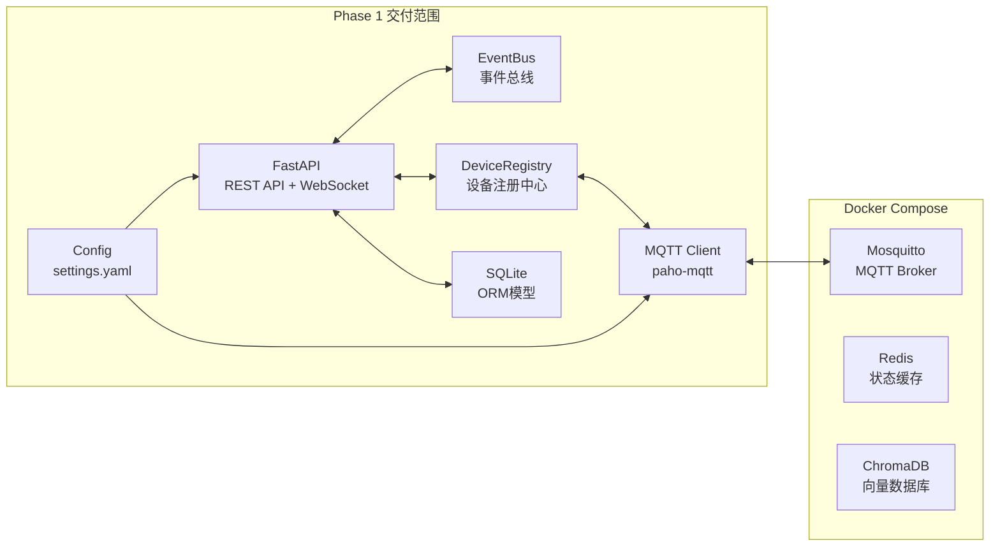

# EaseAgent Phase 1 执行计划

## 已确认的决策

- **部署模式**: 模式C(混合) - 有GPU，支持配置切换到模式A/B
- **云端LLM**: 阿里云 DashScope (Qwen-VL-Max)，API Key 先占位
- **项目路径**: `E:\easeagent`
- **MQTT**: Docker Compose 内置 Mosquitto，代码先写好，用户后续自行启动
- **飞书**: 占位符，后续填入
- **执行范围**: 仅 Phase 1

---

## Phase 1 交付物

### 1. 项目根目录文件

- `E:\easeagent\docker-compose.yml` - 编排 Mosquitto / Redis / ChromaDB / FastAPI core / (可选 Ollama)
- `E:\easeagent\requirements.txt` - Python 依赖（固定版本）
- `E:\easeagent\Dockerfile` - FastAPI core 服务的镜像
- `E:\easeagent\.env.example` - 环境变量模板（API Key 等敏感信息走 env）
- `E:\easeagent\.gitignore`

### 2. 配置文件 `config/`

- `settings.yaml` - 全局配置（MQTT/Redis/LLM provider/摄像头等），已根据确认结果填好默认值
- `rooms.yaml` - 房间-设备映射模板（示例数据）
- `agent_prompt.yaml` - Agent 系统提示词（方案中已定义，直接写入）

### 3. 核心层 `core/`

- `main.py` - FastAPI 入口，lifespan 管理（启动时连接 MQTT/Redis/ChromaDB，关闭时清理）
- `config.py` - 用 Pydantic Settings 加载 `settings.yaml` + `.env`
- `models.py` - SQLAlchemy ORM 模型（Employee / Device / Room / DecisionLog / Preference）
- `event_bus.py` - 基于 asyncio 的事件总线（发布-订阅模式，连接感知层与认知层）
- `dependencies.py` - FastAPI 依赖注入（获取 db session / mqtt client / event bus 等）
- `database.py` - SQLite 数据库连接与初始化

### 4. IoT 通信层 `iot/`

- `mqtt_client.py` - paho-mqtt 异步封装（connect/publish/subscribe/reconnect/心跳）
- `device_registry.py` - 设备注册中心（增删查改设备、追踪在线状态、MQTT 心跳检测）
- `protocols/` - 协议适配器基类（`base.py`），具体协议文件留空骨架待 Phase 5 填充

### 5. API 路由层 `api/`

- `routes/devices.py` - 设备管理 CRUD API
- `routes/rooms.py` - 房间管理 CRUD API
- `routes/employees.py` - 员工管理 API（人脸录入接口预留）
- `routes/preferences.py` - 偏好管理 API
- `routes/agent_log.py` - Agent 决策日志查询 API
- `routes/toilet.py` - 厕位状态 API
- `websocket/realtime.py` - WebSocket 实时推送（设备状态变更 / 厕位更新）

### 6. 辅助文件

- `scripts/init_db.py` - 数据库初始化脚本
- `monitor/health_check.py` - 健康检查骨架

---

## 架构数据流（Phase 1 范围）

## 关键实现细节

- **配置加载**: Pydantic BaseSettings 读取 `config/settings.yaml`，敏感信息（API Key）通过 `.env` 文件覆盖
- **MQTT Client**: 基于 `asyncio-mqtt`（aiomqtt）封装，支持自动重连、消息回调注册、topic 通配符订阅
- **事件总线**: 纯内存 pub-sub，基于 `asyncio.Queue`，支持按事件类型注册多个异步 handler
- **设备注册**: 内存 + SQLite 持久化，设备通过 MQTT `easeagent/+/+/heartbeat` 上报心跳，超时标记离线
- **ORM 模型**: SQLAlchemy 2.0 async，SQLite 本地文件 `data/easeagent.db`
- **API 设计**: RESTful，统一用 Pydantic schema 做 request/response validation

## 文件数量估算

约 25-30 个文件，核心代码量约 1500-2000 行。
