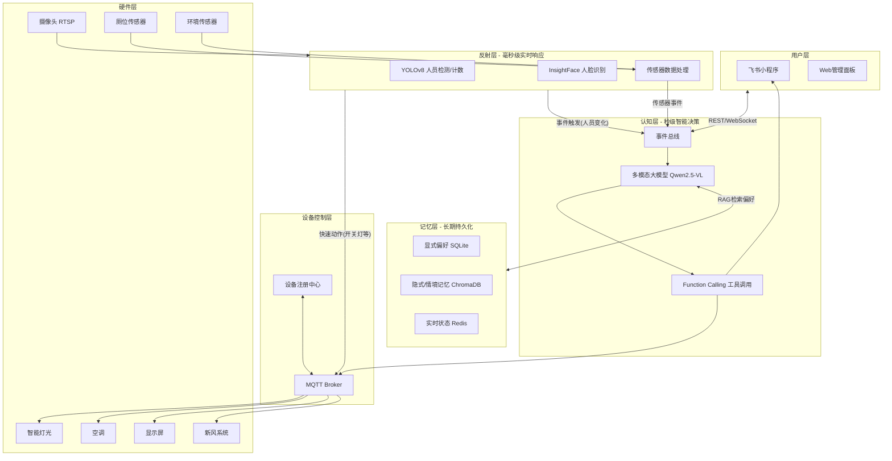
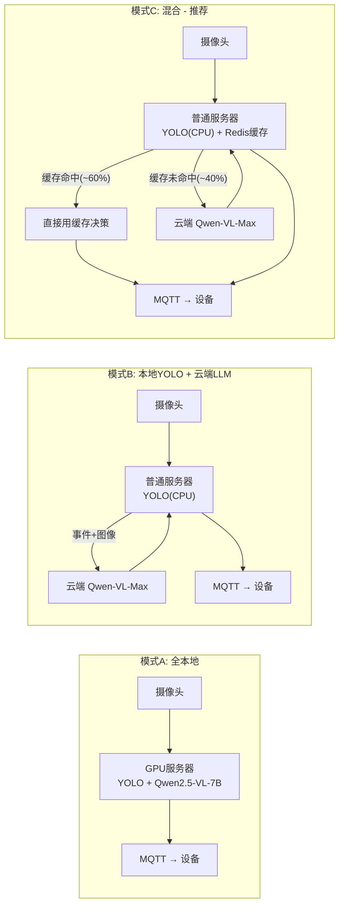
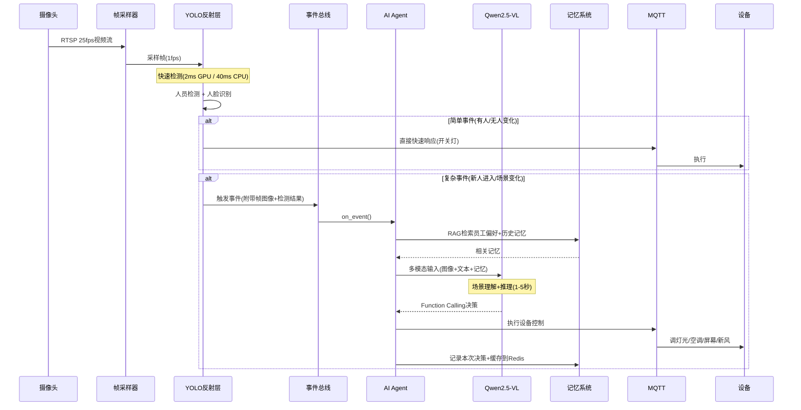
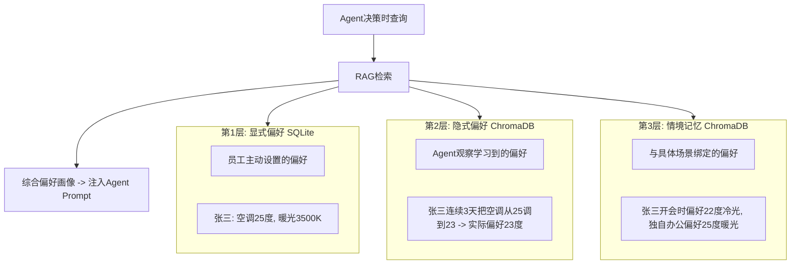
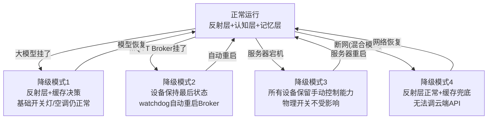

# EaseAgent 智能办公室 - 技术实现方案

## 已确认决策


| 决策项               | 确认结果                                                                   |
| ----------------- | ---------------------------------------------------------------------- |
| 部署模式              | **模式C: 混合部署**（反射层本地 + 复杂决策调云端 + Redis缓存兜底）。用户有GPU，可通过配置切换到模式A全本地       |
| 云端大模型             | **阿里云 DashScope** (Qwen-VL-Max)，API Key 后续填入 `.env`                    |
| 项目路径              | `E:\easeagent`                                                         |
| 当前执行范围            | **Phase 1**（脚手架 + Docker Compose + MQTT通信 + 设备注册 + 事件总线 + FastAPI API） |
| MQTT Broker       | Docker Compose 内置 Mosquitto，代码先写好，用户后续自行启动容器                           |
| 飞书开发者             | 尚未创建，代码中使用占位符，后续填入                                                     |
| DashScope API Key | 尚未获取，`.env` 中占位，Phase 3 之前填入即可                                         |


---

## 一、核心架构：双层 AI + 记忆系统




- **反射层(YOLO+InsightFace)**: 毫秒级简单感知(有人/无人、人脸身份)，类似"条件反射"
- **认知层(多模态大模型)**: 理解场景语义、分析行为意图、综合偏好做复杂决策，类似"大脑思考"
- **记忆层(SQLite+ChromaDB+Redis)**: 存储员工偏好、历史行为、实时状态，Agent 可随时检索

---

## 二、技术选型

- **后端框架**: Python 3.11 + FastAPI (REST API + WebSocket)
- **反射层 AI**: OpenCV + YOLOv8n (实时人员检测) + InsightFace (人脸识别)
- **认知层 AI**: [已确认] 阿里云 DashScope Qwen-VL-Max (云端API，主用) / Qwen2.5-VL-7B (本地Ollama，可选切换)
- **Agent 框架**: 自研轻量 Agent Loop (基于 Function Calling)
- **记忆系统**: SQLite (显式偏好) + ChromaDB (向量记忆/RAG) + Redis (实时状态缓存)
- **IoT 通信**: [已确认] MQTT (Docker Compose 内置 Mosquitto) + aiomqtt (Python异步客户端)
- **前端**: Vue 3 + Vite (Web管理面板)
- **飞书**: [待配置] 飞书开放平台 SDK (小程序 + 机器人)，app_id/secret 后续填入
- **模型推理**: [已确认] 阿里云 DashScope API (默认) / Ollama (配置切换)
- **部署**: Docker Compose
- **项目路径**: [已确认] `E:\easeagent`

### 大模型选型


| 方案    | 模型            | 显存需求     | 推理速度     | 适用场景        |
| ----- | ------------- | -------- | -------- | ----------- |
| 本地首选  | Qwen2.5-VL-7B | 16GB GPU | 1-3秒/帧   | 数据不出内网，隐私安全 |
| 本地备选  | InternVL2-8B  | 16GB GPU | 1-3秒/帧   | 国产开源，中文能力强  |
| 本地轻量  | Qwen2.5-VL-3B | 8GB GPU  | 0.5-1秒/帧 | GPU资源有限时    |
| 云端API | Qwen-VL-Max   | 无需GPU    | 2-5秒/帧   | 无GPU或混合部署   |


### 三种部署模式




- **模式A**: 需要 GPU 服务器(RTX 4060 16GB+)，数据全部本地处理
- **模式B**: 普通服务器即可(无GPU)，LLM 全部调云端 API，依赖网络
- **模式C(推荐) [已确认选择]**: 用户有GPU服务器，默认采用混合模式。反射层本地处理(YOLO可用GPU加速)，复杂决策调云端DashScope，缓存命中时跳过API调用。断网时降级为反射层+缓存兜底。可通过 `settings.yaml` 中 `llm.provider` 切换为全本地(ollama)模式

---

## 三、项目目录结构

```
easeagent/
├── docker-compose.yml
├── requirements.txt
├── config/
│   ├── settings.yaml              # 全局配置
│   ├── rooms.yaml                 # 房间-设备映射
│   └── agent_prompt.yaml          # Agent系统提示词(可热更新)
├── core/
│   ├── main.py                    # FastAPI 入口
│   ├── config.py                  # 配置加载
│   ├── models.py                  # 数据库 ORM 模型
│   ├── event_bus.py               # 事件总线(连接各层)
│   └── dependencies.py            # 依赖注入
├── perception/                    # 反射层 - 实时感知
│   ├── detector.py                # YOLOv8 人员检测
│   ├── face_recognizer.py         # InsightFace 人脸识别
│   ├── camera_manager.py          # RTSP 摄像头流管理
│   ├── frame_sampler.py           # 智能帧采样(变化检测触发)
│   └── sensor_collector.py        # 传感器数据采集
├── agent/                         # 认知层 - AI Agent 核心
│   ├── llm_client.py              # 多模态大模型客户端(本地Ollama/云端API自动切换)
│   ├── agent_loop.py              # Agent主循环(Observe→Think→Act→Reflect)
│   ├── tools.py                   # Function Calling工具定义(JSON Schema)
│   ├── tool_executor.py           # 工具执行器(工具名→实际函数的路由分发)
│   ├── prompt_builder.py          # 动态构建多模态Prompt
│   └── conflict_resolver.py       # 多人偏好冲突协调
├── memory/                        # 记忆层
│   ├── explicit_store.py          # 显式偏好(SQLite CRUD)
│   ├── implicit_store.py          # 隐式偏好(ChromaDB向量存储)
│   ├── context_memory.py          # 情境记忆(带场景标签)
│   ├── rag_retriever.py           # RAG检索(决策时拉取相关记忆)
│   └── preference_learner.py      # 偏好学习器(从Agent行为中提取)
├── iot/
│   ├── mqtt_client.py             # MQTT 客户端(paho-mqtt封装)
│   ├── device_registry.py         # 设备注册与状态管理
│   └── protocols/                 # 各设备协议适配
│       ├── light_protocol.py      # 智能灯: MQTT直连 / Zigbee网关转发
│       ├── ac_protocol.py         # 空调: 红外转发器HTTP / 中央空调BACnet网关
│       ├── screen_protocol.py     # 屏幕: WebSocket推送内容
│       └── sensor_protocol.py     # 传感器: MQTT上报
├── api/
│   ├── routes/
│   │   ├── devices.py             # 设备管理API
│   │   ├── rooms.py               # 房间管理API
│   │   ├── employees.py           # 员工管理(人脸录入+偏好设置)
│   │   ├── preferences.py         # 偏好管理API
│   │   ├── agent_log.py           # Agent决策日志API
│   │   └── toilet.py              # 厕所状态API
│   └── websocket/
│       └── realtime.py            # WebSocket 实时推送
├── feishu/
│   ├── bot.py                     # 飞书机器人
│   ├── mini_app_api.py            # 飞书小程序后端接口
│   └── attendance.py              # 飞书考勤数据对接
├── monitor/                       # 运维监控
│   ├── health_check.py            # 各组件健康检查
│   ├── watchdog.py                # 看门狗(异常自动重启)
│   └── metrics.py                 # 性能指标采集(推理延迟/设备在线率)
├── web/                           # Vue 3 管理面板
│   ├── src/
│   │   ├── views/
│   │   │   ├── Dashboard.vue      # 总览面板(含监控指标)
│   │   │   ├── Devices.vue        # 设备管理
│   │   │   ├── Rooms.vue          # 房间管理
│   │   │   ├── Employees.vue      # 员工管理
│   │   │   ├── AgentLog.vue       # Agent决策日志
│   │   │   └── ToiletStatus.vue   # 厕位状态
│   │   └── components/
│   └── package.json
└── scripts/
    ├── init_db.py
    ├── register_faces.py
    └── init_vector_db.py          # 初始化向量数据库
```

---

## 四、Agent 核心机制

### 4.1 Agent 主循环 (`agent/agent_loop.py`)

```python
class EaseAgent:
    """
    核心AI Agent - 基于多模态大模型的自主决策引擎
    采用 Observe -> Think -> Act -> Reflect 循环
    """
    def __init__(self, llm_client, memory, tool_executor, event_bus):
        self.llm = llm_client           # Qwen2.5-VL 客户端
        self.memory = memory             # 记忆系统
        self.executor = tool_executor    # 工具执行器
        self.event_bus = event_bus       # 事件总线
        self.scene_context = {}          # 当前场景短期上下文

    async def on_event(self, event: Event):
        """事件驱动的Agent决策入口"""
        # 1. OBSERVE - 组装多模态输入
        prompt = await self.build_prompt(event)
        
        # 2. THINK - 大模型推理(支持重试)
        response = await self.llm.chat(
            messages=prompt,
            tools=TOOL_DEFINITIONS
        )
        
        # 3. ACT - 执行工具调用
        results = []
        for tool_call in response.tool_calls:
            result = await self.executor.execute(tool_call)
            results.append(result)
        
        # 4. REFLECT - 记录决策并更新记忆
        await self.memory.record_decision(event, response, results)

    async def build_prompt(self, event: Event):
        """动态构建包含场景图像+记忆+传感器数据的多模态Prompt"""
        frame = event.frame
        memories = await self.memory.retrieve(event)
        sensor_data = await self.get_sensor_snapshot()
        people = event.detected_people
        
        return [
            {"role": "system", "content": AGENT_SYSTEM_PROMPT},
            {"role": "user", "content": [
                {"type": "image", "image": frame},
                {"type": "text", "text": f"""
当前时间: {now}
房间: {event.room_id} ({event.room_name})
在场人员: {people}
传感器: 温度{sensor_data.temp}°C, CO2 {sensor_data.co2}ppm, 湿度{sensor_data.humidity}%
当前设备状态: {device_states}
相关记忆: {memories}

请观察画面，分析当前场景，决定是否需要调整办公环境。"""}
            ]}
        ]
```

### 4.2 Function Calling 工具定义 (`agent/tools.py`)

```python
TOOL_DEFINITIONS = [
    {
        "type": "function",
        "function": {
            "name": "control_light",
            "description": "控制指定房间的灯光",
            "parameters": {
                "type": "object",
                "properties": {
                    "room_id": {"type": "string"},
                    "device_id": {"type": "string", "description": "具体灯具ID，不填则控制整个房间"},
                    "action": {"type": "string", "enum": ["on", "off", "adjust"]},
                    "brightness": {"type": "integer", "minimum": 0, "maximum": 100},
                    "color_temp": {"type": "integer", "minimum": 2700, "maximum": 6500,
                                   "description": "色温(K)，2700暖光-6500冷白光"}
                },
                "required": ["room_id", "action"]
            }
        }
    },
    {
        "type": "function",
        "function": {
            "name": "control_ac",
            "description": "控制空调",
            "parameters": {
                "type": "object",
                "properties": {
                    "room_id": {"type": "string"},
                    "action": {"type": "string", "enum": ["on", "off", "adjust"]},
                    "temperature": {"type": "number"},
                    "mode": {"type": "string", "enum": ["cool", "heat", "auto", "fan"]}
                },
                "required": ["room_id", "action"]
            }
        }
    },
    {
        "type": "function",
        "function": {
            "name": "control_screen",
            "description": "控制显示屏内容",
            "parameters": {
                "type": "object",
                "properties": {
                    "screen_id": {"type": "string"},
                    "content_type": {"type": "string", "enum": ["welcome", "schedule", "announcement", "dashboard", "custom"]},
                    "message": {"type": "string", "description": "自定义消息内容"},
                    "target_employee": {"type": "string", "description": "针对特定员工的个性化内容"}
                },
                "required": ["screen_id", "content_type"]
            }
        }
    },
    {
        "type": "function",
        "function": {
            "name": "control_fresh_air",
            "description": "控制新风系统",
            "parameters": {
                "type": "object",
                "properties": {
                    "level": {"type": "string", "enum": ["off", "low", "medium", "high", "max"]},
                    "reason": {"type": "string", "description": "调节原因，用于日志记录"}
                },
                "required": ["level"]
            }
        }
    },
    {
        "type": "function",
        "function": {
            "name": "get_employee_preference",
            "description": "查询员工的环境偏好设置",
            "parameters": {
                "type": "object",
                "properties": {
                    "employee_id": {"type": "string"},
                    "context": {"type": "string", "description": "当前情境，如'独自办公'、'开会'等"}
                },
                "required": ["employee_id"]
            }
        }
    },
    {
        "type": "function",
        "function": {
            "name": "notify_feishu",
            "description": "通过飞书发送通知给员工",
            "parameters": {
                "type": "object",
                "properties": {
                    "employee_id": {"type": "string"},
                    "message": {"type": "string"},
                    "msg_type": {"type": "string", "enum": ["text", "card", "toilet_status"]}
                },
                "required": ["employee_id", "message"]
            }
        }
    },
    {
        "type": "function",
        "function": {
            "name": "update_preference_memory",
            "description": "当观察到员工手动调整设备时，更新其偏好记忆",
            "parameters": {
                "type": "object",
                "properties": {
                    "employee_id": {"type": "string"},
                    "observation": {"type": "string", "description": "观察到的偏好行为描述"},
                    "context": {"type": "string", "description": "行为发生时的情境"}
                },
                "required": ["employee_id", "observation"]
            }
        }
    }
]
```

### 4.3 工具执行器 (`agent/tool_executor.py`)

工具执行器是连接大模型的 JSON 输出与真实设备操作的桥梁。大模型输出 `{"name": "control_light", "arguments": {...}}`，执行器负责解析并调用对应的实际控制函数。

```python
class ToolExecutor:
    def __init__(self, mqtt_client, feishu_client, memory, device_registry):
        self.mqtt = mqtt_client          # paho-mqtt 客户端
        self.feishu = feishu_client       # 飞书 SDK
        self.memory = memory
        self.devices = device_registry
        
        self._handlers = {
            "control_light":            self._handle_light,
            "control_ac":               self._handle_ac,
            "control_screen":           self._handle_screen,
            "control_fresh_air":        self._handle_fresh_air,
            "get_employee_preference":  self._handle_get_preference,
            "notify_feishu":            self._handle_notify,
            "update_preference_memory": self._handle_update_memory,
        }

    async def execute(self, tool_call) -> str:
        handler = self._handlers.get(tool_call.function.name)
        if not handler:
            return json.dumps({"status": "error", "message": f"未知工具: {tool_call.function.name}"})
        args = json.loads(tool_call.function.arguments)
        try:
            result = await handler(**args)
            return json.dumps({"status": "success", "result": result})
        except Exception as e:
            return json.dumps({"status": "error", "message": str(e)})

    async def _handle_light(self, room_id, action, brightness=None,
                            color_temp=None, device_id=None):
        device = self.devices.get(room_id, "light", device_id)
        payload = {"action": action}
        if brightness is not None:
            payload["brightness"] = brightness
        if color_temp is not None:
            payload["color_temp"] = color_temp
        await self.mqtt.publish(
            topic=f"easeagent/{room_id}/light/{device.id}/cmd",
            payload=json.dumps(payload)
        )
        await self.devices.update_state(device.id, payload)
        return {"device": device.id, "action": action}

    async def _handle_ac(self, room_id, action, temperature=None, mode=None):
        device = self.devices.get(room_id, "ac")
        payload = {"action": action}
        if temperature:
            payload["temperature"] = temperature
        if mode:
            payload["mode"] = mode
        await self.mqtt.publish(
            topic=f"easeagent/{room_id}/ac/{device.id}/cmd",
            payload=json.dumps(payload)
        )
        await self.devices.update_state(device.id, payload)
        return {"device": device.id, "action": action}

    async def _handle_screen(self, screen_id, content_type,
                              message=None, target_employee=None):
        payload = {"content_type": content_type}
        if message:
            payload["message"] = message
        if target_employee:
            payload["target_employee"] = target_employee
        await self.mqtt.publish(
            topic=f"easeagent/screen/{screen_id}/content",
            payload=json.dumps(payload)
        )
        return {"screen": screen_id, "content": content_type}

    async def _handle_fresh_air(self, level, reason=None):
        await self.mqtt.publish(
            topic="easeagent/fresh_air/cmd",
            payload=json.dumps({"level": level, "reason": reason})
        )
        return {"level": level}

    async def _handle_get_preference(self, employee_id, context=None):
        explicit = await self.memory.explicit_store.get(employee_id)
        implicit = await self.memory.vector_db.query(
            query=f"{employee_id} {context or '办公'}",
            n_results=5,
            where={"employee_id": employee_id}
        )
        return {
            "explicit": explicit,
            "learned": [doc.text for doc in implicit]
        }

    async def _handle_notify(self, employee_id, message, msg_type="text"):
        emp = await self.memory.explicit_store.get_employee(employee_id)
        await self.feishu.send_message(
            receive_id=emp.feishu_user_id,
            content={"text": message},
            msg_type=msg_type
        )
        return {"notified": employee_id}

    async def _handle_update_memory(self, employee_id, observation, context=None):
        await self.memory.implicit_store.add(
            text=observation,
            metadata={
                "employee_id": employee_id,
                "context": context,
                "timestamp": datetime.now().isoformat()
            }
        )
        return {"updated": employee_id}
```

依赖的 Python 库：

- `paho-mqtt`: MQTT 通信 (`mqtt.publish()`)
- `httpx`: HTTP 请求 (飞书 API / 红外转发器)
- `chromadb`: 向量数据库操作 (`vector_db.query()`)
- `sqlalchemy`: SQLite ORM (`explicit_store.get()`)

### 4.4 双层处理流水线




### 4.5 事件触发策略

不是每一帧都送给大模型，由以下事件触发 Agent 思考：

- **人员变化事件**: YOLO 检测到人数增减 或 InsightFace 识别到新面孔
- **传感器异常事件**: CO2 突然升高、温度超出范围
- **定时巡检事件**: 每 30 秒-1 分钟做一次全局场景分析
- **用户请求事件**: 飞书小程序中员工发来指令
- **设备状态变化**: 员工手动操作了设备(说明 Agent 的设置不合适，触发偏好学习)

### 4.6 实时无感体验策略

用户感知到的响应必须 < 1 秒，即使大模型需要 2-5 秒。通过四层策略实现：

```python
async def on_person_detected(camera_id, person_id, frame):
    room = get_room(camera_id)
    
    # 策略1: 缓存命中 → 瞬时响应(~50ms)
    cached = await redis.get(f"decision:{room.id}:{person_id}")
    if cached:
        await execute_cached_actions(cached)
        return
    
    # 策略2: 反射层默认动作 → 即时响应(~50ms)
    await quick_default_action(room)  # 先用默认亮度开灯
    
    # 策略3: 认知层异步精调 → 2-5秒后静默微调
    asyncio.create_task(agent_deep_think_and_cache(room, person_id, frame))

async def agent_deep_think_and_cache(room, person_id, frame):
    decision = await agent.on_event(event)
    # 缓存决策结果，下次同场景直接复用
    await redis.set(
        f"decision:{room.id}:{person_id}",
        json.dumps(decision),
        ex=7200  # 2小时过期
    )
```

```
策略4(预测式预加载):
飞书考勤+历史规律 → 预测张三8:50到 → 8:49提前准备好灯/空调/屏幕
APScheduler定时任务驱动，员工到达时一切已就绪

用户体验时间线:
0ms      张三走进办公室
50ms     灯亮了(反射层/缓存)        ← 用户感知：即时
2000ms   灯光从默认80%平滑过渡到70%  ← 用户感知：自然过渡，几乎无感
```

---

## 五、记忆系统 (`memory/`)

### 5.1 三层记忆架构




### 5.2 偏好学习闭环

```python
class PreferenceLearner:
    """从Agent的执行效果中学习员工偏好"""
    
    async def learn_from_feedback(self, decision_log):
        """
        学习逻辑:
        1. Agent设了25度空调
        2. 10分钟后检测到张三手动调到23度
        3. 记录: 张三在[当前情境]下偏好23度而非25度
        4. 下次Agent自动设23度
        """
        if decision_log.user_override:
            memory_text = (
                f"{decision_log.employee_name}在"
                f"{decision_log.context}情境下，"
                f"将{decision_log.device_type}从"
                f"{decision_log.agent_value}改为"
                f"{decision_log.user_value}，"
                f"说明其偏好为{decision_log.user_value}"
            )
            await self.vector_store.add(
                text=memory_text,
                metadata={
                    "employee_id": decision_log.employee_id,
                    "context": decision_log.context,
                    "device_type": decision_log.device_type,
                    "timestamp": now()
                }
            )
```

---

## 六、五大模块实现

每个模块通过 Agent 的工具调用统一处理，不再有独立策略类。

### 灯光控制

- 反射层: YOLO 检测到无人 → 直接 MQTT 关灯
- 认知层: 人脸识别到张三 → Agent 查询偏好 → `control_light(brightness=70, color_temp=3500)`

### 屏幕控制

- 认知层: 人脸识别到员工 → Agent 理解场景(迎宾/开会/路过) → `control_screen(content_type="welcome", message="张三早上好")`
- 认知层: 到达特定时段 → `control_screen(content_type="dashboard")`

### 空调控制

- 反射层: YOLO 检测 15 分钟无人 → 直接关空调
- 认知层: 多人在场 → Agent 综合偏好协商 → `control_ac(temperature=24)`
- 定时层: APScheduler + 飞书考勤 → 提前 30 分钟预启动

### 新风控制

- 反射层: CO2 > 1000ppm → 直接加大新风(安全优先)
- 认知层: Agent 综合空调+新风协调 → `control_fresh_air(level="medium", reason="CO2偏高但室外低温")`

### 厕所监测

- 反射层: 门磁传感器状态变化 → 直接更新 Redis → WebSocket 推送前端
- 认知层: Agent 分析使用模式 → `notify_feishu(message="您关注的3楼卫生间有空位")`

---

## 七、硬件要求

### 7.1 摄像头要求


| 参数  | 最低要求    | 推荐             |
| --- | ------- | -------------- |
| 分辨率 | 1080P   | 2K (2560x1440) |
| 帧率  | 15fps   | 25fps          |
| 编码  | H.264   | H.265 (带宽减半)   |
| 协议  | 必须 RTSP | RTSP + ONVIF   |
| 夜视  | IR 红外   | 星光级传感器         |
| 视角  | 90度     | 120度广角         |
| 供电  | -       | PoE (802.3af)  |
| 网络  | -       | 有线以太网          |


安装位置策略:

- 入口: 枪机定焦，门口正上方 2.5-3米，略俯 15-20 度 → 人脸正脸捕获
- 办公区: 半球广角，天花板中央 → 区域人数统计
- 会议室: 半球广角，门口对角天花板 → 人员进出
- 人脸识别要求面部区域 >= 80x80 像素，侧面角度 < 45 度

### 7.2 网络方案

```
单路摄像头带宽:
  主码流 1080P H.265 25fps = 2~4 Mbps (录像用)
  副码流 720P (AI分析用)   = 0.5~1 Mbps
  
10路摄像头总需求: ~50 Mbps → 千兆交换机即可
```

推荐网络拓扑:

```
办公室主路由器
  └── 千兆PoE交换机(16口, 802.3af/at, 总功率≥240W)
        ├── 端口1-10:  摄像头(PoE供电+数据)
        ├── 端口11-12: 传感器网关
        ├── 端口13:    EaseAgent服务器
        ├── 端口14:    上联到路由器
        └── 端口15-16: 预留

所有设备同网段 192.168.1.x，无需 VLAN
网线: 六类(CAT6) 无氧铜，单段 ≤ 80 米
推荐交换机: 海康DS-3E0510P-E(8口¥400) 或 TP-LINK TL-SG1218PE(16口¥800)
```

### 7.3 服务器要求


| 部署模式       | CPU           | GPU           | 内存   | 存储        |
| ---------- | ------------- | ------------- | ---- | --------- |
| 全本地(模式A)   | i7/Ryzen7 8核+ | RTX 4060 16GB | 32GB | 512GB SSD |
| 云端API(模式B) | i5/Ryzen5 6核  | 无需            | 16GB | 256GB SSD |
| 混合(模式C)    | i5/Ryzen5 6核  | 无需            | 16GB | 256GB SSD |


### 7.4 设备协议兼容方案

不同硬件设备需要不同的协议适配:


| 设备类型                 | 常见协议            | 适配方案                                          |
| -------------------- | --------------- | --------------------------------------------- |
| WiFi智能灯(涂鸦/Yeelight) | 厂商私有API         | 通过 `tuya-connector` / Yeelight SDK → 封装为 MQTT |
| Zigbee智能灯            | Zigbee 3.0      | Zigbee2MQTT 网关(CC2652P) → 自动桥接到 MQTT          |
| 传统灯光(继电器)            | 干接点             | ESP32 + 继电器模块 → MQTT                          |
| 分体空调(遥控器)            | 红外              | Broadlink RM4 红外转发器 → HTTP API → 封装为 MQTT     |
| 中央空调                 | BACnet / Modbus | BACnet 网关(如 Intesis) → HTTP/MQTT              |
| 显示屏(安卓广告屏)           | -               | 屏幕端运行 WebView 客户端，WebSocket 接收内容指令            |
| 显示屏(树莓派+显示器)         | -               | 运行 Chromium Kiosk 模式，WebSocket 客户端            |
| CO2/温湿度传感器           | Zigbee/WiFi     | Zigbee2MQTT 或 WiFi 直连 → MQTT 上报               |
| 厕位门磁传感器              | Zigbee          | Zigbee2MQTT → 状态变化 → MQTT                     |


`iot/protocols/` 中每个文件封装一种设备的控制协议，对上层(ToolExecutor)暴露统一接口。

---

## 八、故障降级与容错




关键设计原则:

- 所有设备必须保留物理手动控制能力，AI 是增强而非替代
- 反射层和认知层独立运行，大模型挂了不影响基础开关灯
- MQTT Broker 配置持久化会话(clean_session=False)，重启后自动恢复订阅
- `monitor/watchdog.py` 每 30 秒检查各组件健康状态，异常自动重启
- 7B 模型 Function Calling 错误率约 10-15%，执行器需实现重试机制(最多 2 次)

---

## 九、运维监控 (`monitor/`)

监控指标(通过 Web 管理面板 Dashboard 展示):

- **摄像头**: 每路是否在线、当前帧率、最后一帧时间
- **AI 推理**: YOLO 每秒检测次数、大模型推理延迟(平均/P99)、Function Calling 成功率
- **设备**: 每个 IoT 设备在线状态(MQTT 心跳)、最后控制时间
- **Agent**: 每次决策的输入(图像+传感器)和输出(工具调用)完整日志，可回溯审计
- **系统**: CPU/内存/GPU 使用率、MQTT 消息吞吐量、Redis 内存占用

```python
# monitor/health_check.py
class HealthChecker:
    async def check_all(self) -> dict:
        return {
            "cameras": await self._check_cameras(),      # 逐路检查RTSP连通性
            "mqtt": await self._check_mqtt(),             # 发测试消息验证Broker
            "llm": await self._check_llm(),               # 发简单prompt验证模型响应
            "redis": await self._check_redis(),            # PING
            "chromadb": await self._check_chromadb(),      # 查询测试
            "devices": await self._check_device_heartbeats(),  # 设备最后心跳时间
        }
```

---

## 十、配置文件

```yaml
# config/settings.yaml
server:
  host: 0.0.0.0
  port: 8000

mqtt:
  broker: 192.168.1.100
  port: 1883

redis:
  host: localhost
  port: 6379

chromadb:
  persist_directory: ./data/chromadb

ai:
  yolo_model: yolov8n.pt
  face_model: buffalo_l
  detection_interval: 1.0
  face_recognition_threshold: 0.6

llm:
  provider: dashscope             # [已确认] dashscope(阿里云API，默认) / ollama(本地，用户有GPU可切换)
  model: qwen3.5-plus             # DashScope 模型名 (Qwen3.5 系列)
  api_key: ${DASHSCOPE_API_KEY}   # [待填入] 从 .env 文件读取
  base_url: https://dashscope.aliyuncs.com/compatible-mode/v1  # OpenAI 兼容端点
  max_retries: 2                  # Function Calling 失败重试次数
  fallback_provider: ollama       # 降级方案: 本地 Ollama (用户有GPU)
  fallback_model: qwen3.5:9b     # 本地模型 (RTX 4090 24GB)
  fallback_base_url: http://localhost:11434

cameras:
  - id: cam_entrance
    rtsp_url: rtsp://192.168.1.10:554/stream1
    room: entrance
    purpose: [face_recognition, person_detection]
  - id: cam_zone_a
    rtsp_url: rtsp://192.168.1.11:554/stream1
    room: zone_a
    purpose: [person_detection]

feishu:                             # [待配置] 飞书开发者账号尚未创建，以下为占位符
  app_id: ${FEISHU_APP_ID}         # 从 .env 文件读取
  app_secret: ${FEISHU_APP_SECRET} # 从 .env 文件读取
  bot_webhook: ${FEISHU_BOT_WEBHOOK}
```

```yaml
# config/rooms.yaml
rooms:
  - id: zone_a
    name: A区办公区
    cameras: [cam_zone_a]
    devices:
      lights: [light_a1, light_a2, light_a3]
      ac: [ac_a1]
      screen: [screen_a1]
    reflex_rules:
      no_person_delay: 300
      co2_high_threshold: 1000

  - id: entrance
    name: 大门入口
    cameras: [cam_entrance]
    devices:
      screen: [screen_entrance]
```

```yaml
# config/agent_prompt.yaml
system_prompt: |
  你是 EaseAgent，一个智能办公室 AI 管家。你通过摄像头和传感器感知办公室环境，
  并通过工具控制灯光、空调、屏幕、新风系统。

  你的职责：
  1. 观察：分析摄像头画面，理解当前场景和人员行为
  2. 识别：确认在场人员身份，调取他们的偏好设置
  3. 决策：综合环境数据、人员偏好、时间段，决定最佳环境参数
  4. 执行：调用工具控制设备
  5. 学习：当员工手动修改了你的设置，记住他们的真实偏好

  决策原则：
  - 多人场景下取偏好的折中值，优先照顾多数人
  - 节能优先：无人区域必须关闭设备
  - 安全优先：CO2超标时立即加大通风
  - 渐进调整：避免突然大幅改变环境参数
```

---

## 十一、部署方案

```yaml
# docker-compose.yml
services:
  ollama:          # 本地大模型推理(模式A需要，模式B/C可去掉)
  core:            # FastAPI + Agent + 感知层 + 监控
  mosquitto:       # MQTT Broker
  redis:           # 实时状态缓存 + 决策缓存
  chromadb:        # 向量数据库(记忆系统)
  web:             # Vue管理面板 (Nginx)
```

---

## 十二、分阶段上线策略

```
阶段1 - 影子模式(2周):
  Agent只观察和记录决策日志，不控制设备
  人工对比Agent决策与实际需求，评估准确率
  目标: Agent决策合理率 > 80%

阶段2 - 单房间试点(2周):
  选一个会议室开启实际控制
  屏幕显示Agent决策原因(增加透明度): "检测到无人，5分钟后将关闭空调"
  收集使用者反馈，调优agent_prompt.yaml

阶段3 - 逐步扩展(按区域):
  确认试点效果后，每周增加一个区域

阶段4 - 全量运行:
  全办公室启用，偏好学习器持续积累数据
  持续监控Agent决策日志，定期优化提示词
```

---

## 十三、开发里程碑

- **Phase 1 (2周) [当前执行]**: 项目脚手架 + Docker Compose + MQTT 通信 + 设备注册 + 事件总线 + FastAPI 基础 API
- **Phase 2 (2周)**: 反射层(YOLOv8 人员检测 + InsightFace 人脸 + RTSP 摄像头管理 + 帧采样器)
- **Phase 3 (2周)**: 认知层(DashScope Qwen-VL-Max 对接 + Agent Loop + Function Calling + 工具执行器 + 重试机制)
- **Phase 4 (2周)**: 记忆层(SQLite 显式偏好 + ChromaDB 向量记忆 + RAG 检索 + 偏好学习器)
- **Phase 5 (1周)**: 五大模块集成(灯光/屏幕/空调/新风/厕所 反射层+认知层联调)
- **Phase 6 (2周)**: 飞书小程序(厕位监测 + 通知推送 + 偏好设置 + 考勤对接)
- **Phase 7 (1周)**: Vue Web 管理面板 + 监控看板 + Docker 部署 + 分阶段上线

